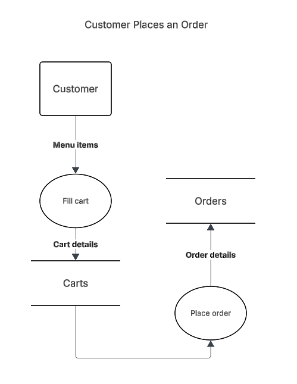
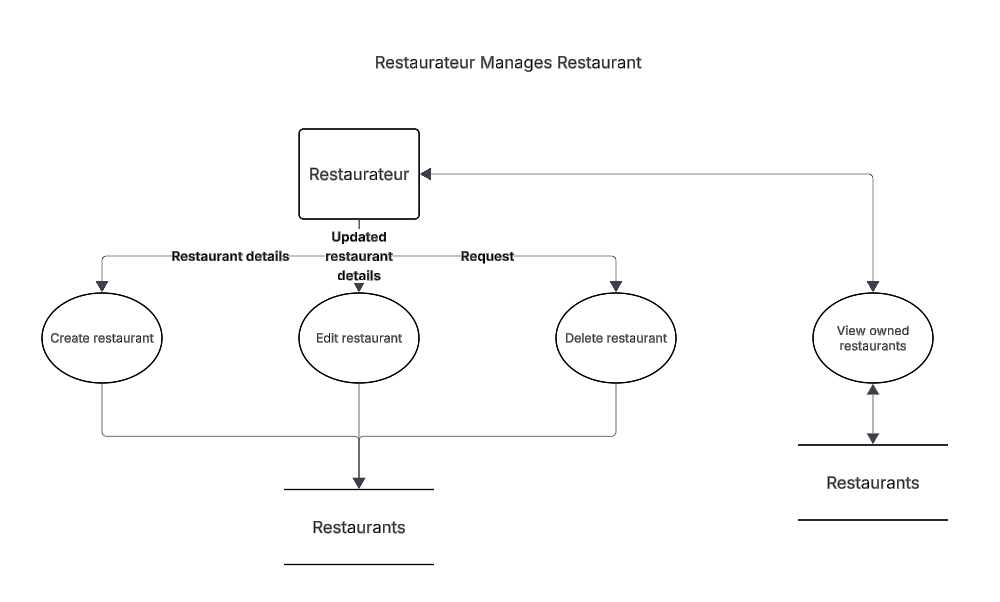
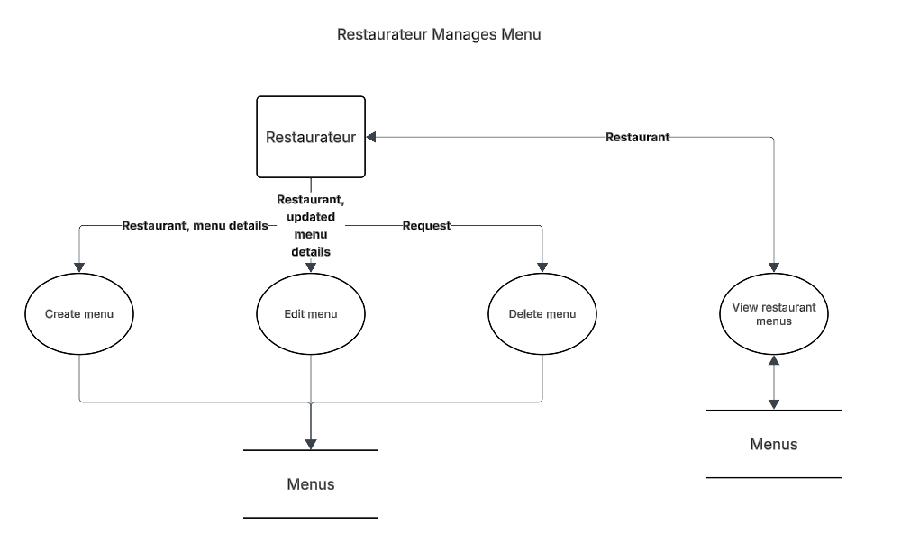
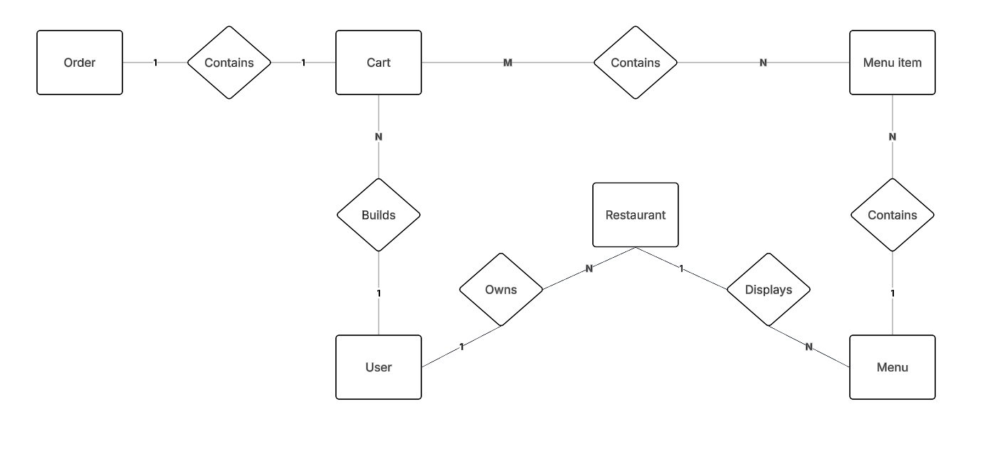

# Design Document

## Data Flow Diagrams

These diagrams are not exhaustive and 100% correct. They should be used to help us during implementation.

## URL Design

- api/                  Return a health status.  
    - restaurants/      Return all restaurants.  
    - restaurant/       INACCESSIBLE.  
        - create/  
        - ID/           Return a single restaurant.  
            - update/  
            - menus/    Return a list of restaurant menus.  
    - menu/             INACCESSIBLE.  
        - create/  
        - ID/           Return a single menu.  
            - update/  
    - dish/             INACCESSIBLE.
        - create/  
        - ID/           Return a single dish.
            - update/  

## Entity Relationship Diagram

### Attributes

Please note only keys are included so far to help with designing the data layout and repository layer.

#### Order

- Order ID (primary key).
- Cart ID (foreign key).

#### Cart

- Cart ID (PK).
- User ID (FK).

#### Cart-menu (Composite)

- Cart ID (PK).
- Menu ID (PK).

#### Menu Item

- Menu item ID (PK).
- Menu ID (FK).

#### Menu

- Menu ID (PK).

#### Restaurant

- Restaurant ID (PK).
- User ID (FK).

#### User

- User ID (PK).
